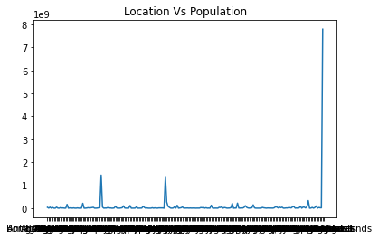
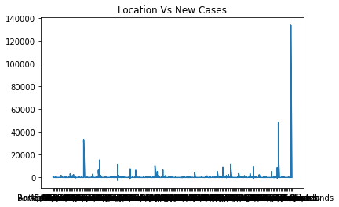
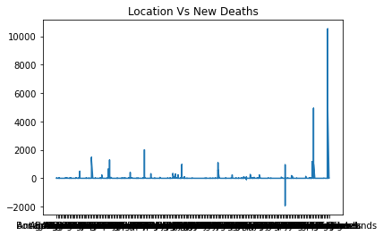
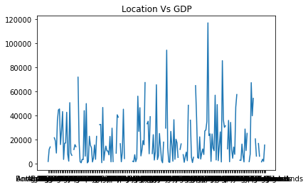

# covid19_analysis
This is a basic analysis on Covid19 data with eight attributes
```python
import pandas as pd
import numpy as np
from matplotlib import pyplot as plt
```


```python
data = pd.read_csv('../data/covid_data.csv')
```


```python
data.head(10)
```


<div>
<style scoped>
    .dataframe tbody tr th:only-of-type {
        vertical-align: middle;
    }

    .dataframe tbody tr th {
        vertical-align: top;
    }

    .dataframe thead th {
        text-align: right;
    }
</style>
<table border="1" class="dataframe">
  <thead>
    <tr style="text-align: right;">
      <th></th>
      <th>location</th>
      <th>date</th>
      <th>new_cases</th>
      <th>new_deaths</th>
      <th>population</th>
      <th>aged_65_older_percent</th>
      <th>gdp_per_capita</th>
      <th>hospital_beds_per_thousand</th>
    </tr>
  </thead>
  <tbody>
    <tr>
      <th>0</th>
      <td>Afghanistan</td>
      <td>2019-12-31</td>
      <td>0</td>
      <td>0</td>
      <td>38928341.0</td>
      <td>2.581</td>
      <td>1803.987</td>
      <td>0.5</td>
    </tr>
    <tr>
      <th>1</th>
      <td>Afghanistan</td>
      <td>2020-01-01</td>
      <td>0</td>
      <td>0</td>
      <td>38928341.0</td>
      <td>2.581</td>
      <td>1803.987</td>
      <td>0.5</td>
    </tr>
    <tr>
      <th>2</th>
      <td>Afghanistan</td>
      <td>2020-01-02</td>
      <td>0</td>
      <td>0</td>
      <td>38928341.0</td>
      <td>2.581</td>
      <td>1803.987</td>
      <td>0.5</td>
    </tr>
    <tr>
      <th>3</th>
      <td>Afghanistan</td>
      <td>2020-01-03</td>
      <td>0</td>
      <td>0</td>
      <td>38928341.0</td>
      <td>2.581</td>
      <td>1803.987</td>
      <td>0.5</td>
    </tr>
    <tr>
      <th>4</th>
      <td>Afghanistan</td>
      <td>2020-01-04</td>
      <td>0</td>
      <td>0</td>
      <td>38928341.0</td>
      <td>2.581</td>
      <td>1803.987</td>
      <td>0.5</td>
    </tr>
    <tr>
      <th>5</th>
      <td>Afghanistan</td>
      <td>2020-01-05</td>
      <td>0</td>
      <td>0</td>
      <td>38928341.0</td>
      <td>2.581</td>
      <td>1803.987</td>
      <td>0.5</td>
    </tr>
    <tr>
      <th>6</th>
      <td>Afghanistan</td>
      <td>2020-01-06</td>
      <td>0</td>
      <td>0</td>
      <td>38928341.0</td>
      <td>2.581</td>
      <td>1803.987</td>
      <td>0.5</td>
    </tr>
    <tr>
      <th>7</th>
      <td>Afghanistan</td>
      <td>2020-01-07</td>
      <td>0</td>
      <td>0</td>
      <td>38928341.0</td>
      <td>2.581</td>
      <td>1803.987</td>
      <td>0.5</td>
    </tr>
    <tr>
      <th>8</th>
      <td>Afghanistan</td>
      <td>2020-01-08</td>
      <td>0</td>
      <td>0</td>
      <td>38928341.0</td>
      <td>2.581</td>
      <td>1803.987</td>
      <td>0.5</td>
    </tr>
    <tr>
      <th>9</th>
      <td>Afghanistan</td>
      <td>2020-01-09</td>
      <td>0</td>
      <td>0</td>
      <td>38928341.0</td>
      <td>2.581</td>
      <td>1803.987</td>
      <td>0.5</td>
    </tr>
  </tbody>
</table>
</div>


```python
data.dropna(inplace = True)
```


```python
newData = data["date"].str.split("-", n = 2, expand = True)
```


```python
# newData
data['year'] = newData[0]
data['month'] = newData[1]
data['day'] = newData[2]
data.drop(columns = ['date'], inplace = True)
```


```python
# data
```


```python

```


```python
# data.isnull
# data.fillna(0)

```


```python
data.shape
```


    (23082, 10)


```python
plt.title("Location Vs Population")
x = data['location']
y = data['population']
plt.plot(x, y)
plt.show()
```


    

    


```python
plt.title("Location Vs New Cases")
x = data['location']
y = data['new_cases']
plt.plot(x, y)
plt.show()
```


    

    


```python
plt.title("Location Vs New Deaths")
x = data['location']
y = data['new_deaths']
plt.plot(x, y)
plt.show()
```


    

    


```python
plt.title("Location Vs GDP")
x = data['location']
y = data['gdp_per_capita']
plt.plot(x, y)
plt.show()
```


    

    


```python

```
